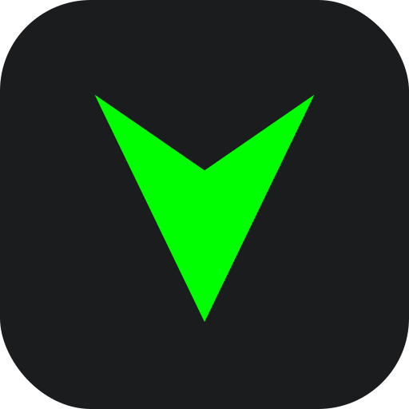

    
    
# Artic Delta

**Artic Delta** is a professional, high-precision performance monitoring tool for Android. It provides real-time frame rate data through a lightweight, non-intrusive floating overlay, designed specifically for gamers who need accurate data without compromising system performance.

## 🚀 Key Features

*   **Zero Special Privileges**: Requires **No Root** and **No ADB** setup. Just install and use.
*   **Draggable Floating Meter**: Reposition the display anywhere on your screen with a simple touch-and-drag gesture.
*   **Live Performance Data**: Displays real-time FPS and frame latency (ms) to help you monitor gameplay smoothness.
*   **Dynamic Health Indicators**: Integrated color-coded status (Green/Yellow/Red) to identify performance drops instantly.
*   **Zero-Lag Engine**: Optimized to have a near-zero footprint on your device's resources.
*   **100% Offline & Private**: Works entirely on-device with no internet connection required and zero data collection.

## 🛠 How to Use

1.  Download the latest APK from the [Releases](https://github.com/Akhilraj739/Artic_Delta/releases) section.
2.  Install and launch the **Artic Delta** app.
3.  Grant the **"Display over other apps"** permission.
4.  Click **"START FPS METER"**.
5.  When prompted by the system, select the specific game or app you want to monitor for maximum precision.
6.  Reposition the meter as needed and start your game!

## ⚠️ Important Limitation

Artic Delta relies on the **"Single App Recording"** feature for maximum accuracy. 

*   **Requirement**: This feature requires **Android 14 (API Level 34) or higher**.
*   **Device Compatibility**: Currently, this app works best on **Pixel devices, Stock Android, and AOSP-based Custom ROMs** that provide the official "Single App" selection dialog. 

Some manufacturers (such as Samsung, Xiaomi, etc.) may hide this option in their custom system skins, forcing the app to capture the **"Entire Screen."** In Entire Screen mode, the meter will detect all visual updates, including system UI animations and **Refresh rate "Touch Boost" spikes** triggered by your finger input. This is a platform-level limitation of the Android security sandbox for non-root apps on certain proprietary skins.

## 👥 Community & Support

Join our official Telegram channels for the latest updates, support, and feedback:

*   **Support Group**: [Artic Discussion](https://t.me/articdiscussion)
*   **Official Channel**: [Artic Project](https://t.me/articproject)

---

## 📜 License & Usage

**Copyright (c) 2024 @Akhilraj739. All rights reserved.**

Artic Delta is **proprietary software**. You are permitted to download and use the provided APK for personal use. You may not decompile, reverse engineer, modify, or redistribute the software or its components without explicit written permission from the author.

---

**Developed with ❤️ by @Akhilraj739**

